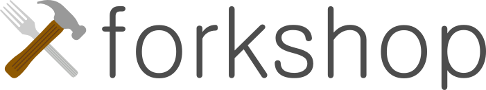

Fork your course
## What is it?
Forkshop is a web app for designing and forking educational workshops.  

## Usage
You'll need [node.js](http://nodejs.org) and [mongodb](http://mongodb.org) to run this application.  Installing these is out-of-scope, and instructions are contained on the links to the left.

1. Clone the project (you can download the zip above or use git)
2. In the project's folder, run `npm install`.  Wait for it to install all necessary components.
3. Run `node app.js`.  

You'll now, by default, have a web application running at http://localhost:9200 -- you can edit the port by changing config.js.

## Contributions
...are welcome.  Please open an issue and submit a pull request.  Contributor guidelines forthcoming.

## License
© 2013 Elliott Hauser, Matt Hoffman, and Eric Martindale.  Provided under a [MIT License](http://opensource.org/licenses/MIT).

## History
Created during a 53* hour [Startup Weekend](http://startupweekend.org/) sprint hosted by [Hub Raleigh](http://www.hubraleigh.com/).

\* Startup weekends are normally 54 hours but was a daylight savings weekend.
